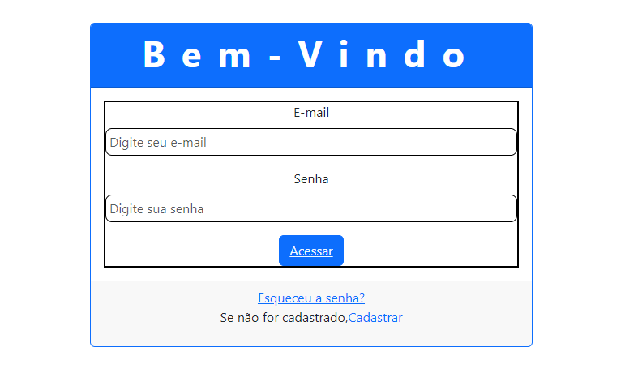

# Formulário de Login📄

Este é um simples formulário de login desenvolvido em HTML, CSS e JavaScript utilizando o framework Bootstrap 5.

## Funcionalidades⚙️

- Permite que os usuários insiram seu e-mail e senha para acessar o sistema.
- Inclui um link para a página de recuperação de senha.
- Utiliza validação de formulário HTML para garantir que os campos de e-mail e senha sejam preenchidos.

## Tecnologias Utilizadas💻

- HTML
- CSS
- JavaScript
- Bootstrap 5

## Estrutura de Arquivos📁

- `login.html`: Contém a estrutura do formulário de login.
- `login.css`: Arquivo de estilo para personalizar a aparência do formulário.
- `login.js`: Arquivo JavaScript para adicionar funcionalidades adicionais ao formulário, se necessário.

## Como Utilizar📌

1. Faça o download dos arquivos HTML, CSS e JavaScript.
2. Abra o arquivo HTML em um navegador da web compatível.
3. Insira seu e-mail e senha nos campos apropriados.
4. Clique no botão "Acessar" para fazer login.
5. Se esqueceu a senha, clique no link "Esqueceu a senha?" para ser redirecionado para a página de recuperação de senha.
6. Se você ainda não tem uma conta, clique no link "Cadastrar" para ser redirecionado para a página de cadastro.

## Autores 📍
[Nayra Vitória dos Santos](https://github.com/nayravsantos)
